# WEB APPLICATION FLOWCHARTS
## Slope Stability Prediction System

This document contains comprehensive flowcharts illustrating the web application's architecture, data flow, and component interactions.

---

## TABLE OF CONTENTS

1. [System Architecture Flowchart](#system-architecture-flowchart)
2. [Backend Request Processing Flowchart](#backend-request-processing-flowchart)
3. [Frontend Component Interaction Flowchart](#frontend-component-interaction-flowchart)
4. [Prediction Pipeline Flowchart](#prediction-pipeline-flowchart)
5. [Error Handling Flowchart](#error-handling-flowchart)
6. [Complete User Journey Flowchart](#complete-user-journey-flowchart)

---

## SYSTEM ARCHITECTURE FLOWCHART

```mermaid
graph TB
    User[👤 User Browser]
    Frontend[🎨 Svelte Frontend<br/>Port 3000]
    Backend[⚙️ Flask Backend<br/>Port 5000]
    Models[🤖 ML Models]
    
    User -->|HTTP Request| Frontend
    Frontend -->|User Input| Form[📝 PredictionForm]
    Form -->|Parameters| Validation{✓ Valid?}
    Validation -->|Yes| API[📡 Axios POST]
    Validation -->|No| Error1[❌ Show Error]
    
    API -->|JSON Payload| Backend
    Backend -->|Load| Models
    Models -->|GB Model| GB[Gradient Boosting<br/>R²=0.9426]
    Models -->|XGB Model| XGB[XGBoost<br/>R²=0.9420]
    Models -->|Scaler| Scale[StandardScaler]
    
    Backend -->|Process| Pipeline[Prediction Pipeline]
    Pipeline -->|Calculate| FoS[Factor of Safety]
    FoS -->|Classify| Safety[Safety Status]
    Safety -->|Response| JSON[📤 JSON Response]
    
    JSON -->|HTTP 200| Frontend
    Frontend -->|Display| Results[📊 ResultsDisplay]
    Results -->|Render| User
    
    style User fill:#e1f5ff
    style Frontend fill:#fff4e6
    style Backend fill:#e8f5e9
    style Models fill:#f3e5f5
    style GB fill:#c8e6c9
    style XGB fill:#c8e6c9
```



---

## BACKEND REQUEST PROCESSING FLOWCHART

```mermaid
flowchart TD
    Start([🚀 Start]) --> Receive[Receive POST Request<br/>on /predict endpoint]
    Receive --> Parse[Parse JSON Body]
    Parse --> CheckParams{All parameters<br/>present?}
    
    CheckParams -->|No| Error400[Return 400 Error<br/>Missing parameters]
    Error400 --> End1([End])
    
    CheckParams -->|Yes| ValidateRange{Parameters<br/>in valid range?}
    ValidateRange -->|No| Error400b[Return 400 Error<br/>Invalid values]
    Error400b --> End2([End])
    
    ValidateRange -->|Yes| ExtractParams[Extract Parameters:<br/>c, φ, γ, Ru, model]
    ExtractParams --> CreateArray[Create Feature Array<br/>shape: 1×4]
    CreateArray --> LoadScaler[Load StandardScaler]
    LoadScaler --> ScaleFeatures[Scale Features<br/>X_scaled = X - μ / σ]
    
    ScaleFeatures --> SelectModel{Which model<br/>selected?}
    SelectModel -->|gradient_boosting| LoadGB[Load GB Model]
    SelectModel -->|xgboost| LoadXGB[Load XGB Model]
    
    LoadGB --> Predict1[model.predict<br/>features_scaled]
    LoadXGB --> Predict1
    
    Predict1 --> ConvertType[Convert numpy.float32<br/>to Python float]
    ConvertType --> CalcCI[Calculate 95% CI<br/>margin = 1.96 × RMSE]
    CalcCI --> LowerBound[lower = FoS - margin]
    LowerBound --> UpperBound[upper = FoS + margin]
    
    UpperBound --> ClassifySafety{Classify FoS}
    ClassifySafety -->|FoS < 1.0| Critical[CRITICAL<br/>Immediate action]
    ClassifySafety -->|1.0 ≤ FoS < 1.3| Warning[WARNING<br/>Requires attention]
    ClassifySafety -->|1.3 ≤ FoS < 1.5| Caution[CAUTION<br/>Monitor regularly]
    ClassifySafety -->|FoS ≥ 1.5| Safe[SAFE<br/>Slope is stable]
    
    Critical --> BuildResponse[Build JSON Response]
    Warning --> BuildResponse
    Caution --> BuildResponse
    Safe --> BuildResponse
    
    BuildResponse --> AddMetrics[Add Model Metrics]
    AddMetrics --> AddInputs[Add Input Parameters]
    AddInputs --> Return200[Return 200 OK<br/>with JSON]
    Return200 --> End3([✅ Success])
    
    style Start fill:#4caf50
    style End3 fill:#4caf50
    style End1 fill:#f44336
    style End2 fill:#f44336
    style Error400 fill:#ffcdd2
    style Error400b fill:#ffcdd2
    style Critical fill:#ef4444
    style Warning fill:#f59e0b
    style Caution fill:#eab308
    style Safe fill:#10b981
```



---

## FRONTEND COMPONENT INTERACTION FLOWCHART

```mermaid
graph TB
    Start([🌐 App Loads]) --> Mount[App.svelte Mounts]
    Mount --> InitState[Initialize State:<br/>selectedModel<br/>prediction<br/>loading<br/>error]
    
    InitState --> RenderLayout[Render Layout:<br/>Header + Grid]
    RenderLayout --> RenderForm[Render PredictionForm]
    RenderLayout --> RenderSidebar[Render ModelInfo]
    
    RenderForm --> UserInput[👤 User Inputs Values]
    UserInput --> FormValidation{Client-side<br/>validation}
    FormValidation -->|Invalid| ShowError[Display Error Message]
    ShowError --> UserInput
    
    FormValidation -->|Valid| ClickSubmit[User Clicks Submit]
    ClickSubmit --> DispatchLoading[dispatch loading event]
    DispatchLoading --> AppSetLoading[App.svelte:<br/>loading = true]
    AppSetLoading --> ShowSpinner[Show Loading Spinner]
    
    ShowSpinner --> AxiosCall[Axios POST to Backend]
    AxiosCall --> WaitResponse{Response<br/>received?}
    
    WaitResponse -->|Success| DispatchPrediction[dispatch prediction event]
    WaitResponse -->|Error| DispatchError[dispatch error event]
    
    DispatchPrediction --> AppSetPrediction[App.svelte:<br/>prediction = data]
    AppSetPrediction --> PassProps[Pass prediction prop<br/>to ResultsDisplay]
    PassProps --> ReactiveUpdate[Reactive statements<br/>execute]
    ReactiveUpdate --> RenderResults[Render Results:<br/>FoS, Safety, Metrics]
    
    DispatchError --> AppSetError[App.svelte:<br/>error = message]
    AppSetError --> ShowErrorMsg[Show Error Message]
    
    RenderResults --> UserAction{User Action}
    ShowErrorMsg --> UserAction
    
    UserAction -->|Adjust Values| UserInput
    UserAction -->|Change Model| ModelChange[Select Different Model]
    ModelChange --> DispatchModelChange[dispatch modelChange]
    DispatchModelChange --> UpdateSidebar[Update ModelInfo Display]
    UpdateSidebar --> UserInput
    
    UserAction -->|Done| End([✅ Complete])
    
    style Start fill:#4caf50
    style End fill:#4caf50
    style ShowError fill:#ffcdd2
    style ShowErrorMsg fill:#ffcdd2
    style RenderResults fill:#c8e6c9
```



---

## PREDICTION PIPELINE FLOWCHART

```mermaid
flowchart LR
    Input[📥 Raw Input<br/>c=25, φ=30<br/>γ=20, Ru=0.3]
    
    Input --> Array[Create Array<br/>25, 30, 20, 0.3]
    Array --> Reshape[Reshape to 1×4]
    Reshape --> Scale[StandardScaler Transform]
    
    Scale --> Scaled[Scaled Features<br/>0.15, -0.42, 0.83, 1.2]
    Scaled --> Model{Select Model}
    
    Model -->|GB| GB[Gradient Boosting<br/>100 trees]
    Model -->|XGB| XGB[XGBoost<br/>300 trees]
    
    GB --> Tree1[Tree 1 Prediction]
    GB --> Tree2[Tree 2 Prediction]
    GB --> TreeN[Tree N Prediction]
    
    XGB --> XTree1[Tree 1 Prediction]
    XGB --> XTree2[Tree 2 Prediction]
    XGB --> XTreeN[Tree N Prediction]
    
    Tree1 --> Sum1[Weighted Sum]
    Tree2 --> Sum1
    TreeN --> Sum1
    
    XTree1 --> Sum2[Weighted Sum]
    XTree2 --> Sum2
    XTreeN --> Sum2
    
    Sum1 --> FoS[FoS = 1.45]
    Sum2 --> FoS
    
    FoS --> CI[Calculate 95% CI<br/>1.29 - 1.61]
    CI --> Classify[Classify Safety<br/>CAUTION]
    Classify --> Response[📤 JSON Response]
    
    style Input fill:#e3f2fd
    style Response fill:#c8e6c9
    style FoS fill:#fff9c4
    style Classify fill:#eab308
```



---

## ERROR HANDLING FLOWCHART


---

## COMPLETE USER JOURNEY FLOWCHART

```mermaid
graph TB
    Start([👤 User Opens Browser]) --> LoadPage[Navigate to<br/>http://localhost:3000]
    LoadPage --> FetchAssets[Download HTML/CSS/JS]
    FetchAssets --> InitApp[Initialize App.svelte]
    InitApp --> RenderUI[Render Initial UI]
    
    RenderUI --> DefaultValues[Show Default Values:<br/>c=25, φ=30, γ=20, Ru=0]
    DefaultValues --> UserDecision{User Action}
    
    UserDecision -->|Keep Defaults| Submit1[Click Predict Button]
    UserDecision -->|Modify Values| AdjustInputs[Adjust Sliders/Inputs]
    AdjustInputs --> ValidateClient{Client<br/>Validation}
    ValidateClient -->|Invalid| ShowErrorClient[Show Error Message]
    ShowErrorClient --> AdjustInputs
    ValidateClient -->|Valid| Submit1
    
    UserDecision -->|Change Model| SwitchModel[Select Model:<br/>GB or XGBoost]
    SwitchModel --> UpdateInfo[Update ModelInfo Panel]
    UpdateInfo --> UserDecision
    
    Submit1 --> SetLoading[Set loading = true<br/>Show spinner]
    SetLoading --> BuildPayload[Build JSON Payload]
    BuildPayload --> SendRequest[Send POST to Backend]
    
    SendRequest --> BackendProcess[Backend Processing...]
    BackendProcess --> BackendResponse{Response Type}
    
    BackendResponse -->|200 OK| ParseSuccess[Parse JSON Response]
    BackendResponse -->|400/500| ParseError[Parse Error Message]
    
    ParseSuccess --> UpdateState[Update prediction state]
    UpdateState --> RenderFoS[Display FoS Value<br/>with confidence interval]
    RenderFoS --> RenderSafety[Display Safety Status<br/>with color coding]
    RenderSafety --> RenderMetrics[Display Model Metrics]
    RenderMetrics --> RenderInputs[Display Input Summary]
    
    ParseError --> DisplayError[Show Error Message]
    DisplayError --> RetryOption{User Action}
    RetryOption -->|Fix Input| AdjustInputs
    RetryOption -->|Give Up| End1([Exit])
    
    RenderInputs --> AnalyzeResults{User Satisfied?}
    AnalyzeResults -->|No| ModifyDecision{Modify What?}
    ModifyDecision -->|Parameters| AdjustInputs
    ModifyDecision -->|Model| SwitchModel
    
    AnalyzeResults -->|Yes| ActionDecision{Next Action}
    ActionDecision -->|New Prediction| UserDecision
    ActionDecision -->|Export/Save| Future[Future Feature:<br/>Export to PDF/CSV]
    ActionDecision -->|Done| End2([✅ Complete])
    
    Future --> End2
    
    style Start fill:#4caf50
    style End2 fill:#4caf50
    style End1 fill:#9e9e9e
    style ShowErrorClient fill:#ffcdd2
    style DisplayError fill:#ffcdd2
    style RenderFoS fill:#e1f5fe
    style RenderSafety fill:#c8e6c9
```



---

## DETAILED COMPONENT LIFECYCLE FLOWCHART

```mermaid
sequenceDiagram
    participant User
    participant Browser
    participant App
    participant Form
    participant Results
    participant Sidebar
    participant Axios
    participant Backend
    participant Models
    
    User->>Browser: Open http://localhost:3000
    Browser->>App: Load App.svelte
    App->>Form: Mount PredictionForm
    App->>Sidebar: Mount ModelInfo
    App->>Results: Mount ResultsDisplay (null)
    
    User->>Form: Enter values (c, φ, γ, Ru)
    Form->>Form: Validate inputs
    User->>Form: Click Submit
    
    Form->>App: dispatch('loading', true)
    App->>Results: Pass loading=true prop
    Results->>User: Show spinner
    
    Form->>Axios: POST /predict with params
    Axios->>Backend: HTTP Request
    
    Backend->>Backend: Validate parameters
    Backend->>Models: Load StandardScaler
    Backend->>Backend: Scale features
    Backend->>Models: Load selected model
    Backend->>Models: model.predict()
    Models-->>Backend: FoS prediction
    Backend->>Backend: Calculate confidence interval
    Backend->>Backend: Classify safety status
    Backend->>Backend: Build JSON response
    
    Backend-->>Axios: HTTP 200 + JSON
    Axios-->>Form: response.data
    Form->>App: dispatch('prediction', data)
    App->>Results: Pass prediction prop
    
    Results->>Results: Execute reactive statements
    Results->>Results: Update safetyStatus
    Results->>Results: Update fos value
    Results->>Results: Calculate display values
    
    Results->>User: Render FoS Card
    Results->>User: Render Safety Status
    Results->>User: Render Metrics
    Results->>User: Render Input Summary
    
    User->>Form: Change model
    Form->>App: dispatch('modelChange', model)
    App->>Sidebar: Update selectedModel prop
    Sidebar->>Sidebar: Load new model data
    Sidebar->>User: Display new metrics
```



---

## DATA TRANSFORMATION FLOWCHART

```mermaid
graph LR
    A[Raw User Input] -->|Form Values| B[JavaScript Objects]
    B -->|parseFloat| C[Numeric Values]
    C -->|JSON.stringify| D[JSON String]
    D -->|HTTP POST| E[Backend Receives]
    
    E -->|request.get_json| F[Python Dict]
    F -->|Extract values| G[Python Variables]
    G -->|np.array| H[NumPy Array<br/>1×4 float64]
    
    H -->|scaler.transform| I[Scaled Array<br/>1×4 float64]
    I -->|model.predict| J[NumPy float32]
    J -->|float| K[Python float]
    
    K -->|dict construction| L[Python Dict]
    L -->|jsonify| M[JSON String]
    M -->|HTTP Response| N[Browser Receives]
    
    N -->|JSON.parse| O[JavaScript Object]
    O -->|Reactive statements| P[Svelte Variables]
    P -->|String interpolation| Q[HTML Display]
    Q -->|Browser render| R[User Sees Results]
    
    style A fill:#e3f2fd
    style R fill:#c8e6c9
    style I fill:#fff9c4
    style J fill:#fff9c4
```



---

## STATE MANAGEMENT FLOWCHART


---

## API REQUEST/RESPONSE FLOWCHART


---

## SAFETY CLASSIFICATION DECISION TREE


---

## MODEL SELECTION LOGIC FLOWCHART


---

## RESPONSIVE DESIGN FLOWCHART

```mermaid
flowchart TB
    Load[Page Loads] --> DetectScreen{Detect<br/>Screen Size}
    
    DetectScreen -->|Desktop ≥1024px| Desktop[Desktop Layout]
    DetectScreen -->|Tablet 768-1023px| Tablet[Tablet Layout]
    DetectScreen -->|Mobile <768px| Mobile[Mobile Layout]
    
    Desktop --> Grid2Col[2-Column Grid:<br/>Main Content | Sidebar]
    Tablet --> Grid1Col[1-Column Grid:<br/>Stacked Layout]
    Mobile --> GridMobile[Single Column:<br/>Full Width]
    
    Grid2Col --> RenderDesktop[Render Desktop UI]
    Grid1Col --> RenderTablet[Render Tablet UI]
    GridMobile --> RenderMobile[Render Mobile UI]
    
    RenderDesktop --> Responsive[All Components Responsive]
    RenderTablet --> Responsive
    RenderMobile --> Responsive
    
    Responsive --> UserInteract[User Interaction]
    UserInteract --> ResizeCheck{Window<br/>Resized?}
    
    ResizeCheck -->|Yes| DetectScreen
    ResizeCheck -->|No| Continue[Continue Using]
    Continue --> UserInteract
    
    style Desktop fill:#e1f5fe
    style Tablet fill:#f3e5f5
    style Mobile fill:#fff9c4
```

---

## CONCLUSION

These flowcharts provide a comprehensive visual representation of the web application's architecture, data flow, and component interactions. They serve as documentation for:

- **Development**: Understanding system design and implementation details
- **Debugging**: Tracing request flow and identifying issues
- **Onboarding**: Helping new team members understand the system
- **Maintenance**: Reference for future updates and enhancements

---

**Document Version**: 1.0  
**Last Updated**: November 2025  
**Created By**: Mining ANN Project Team  
**Format**: Mermaid Flowcharts (GitHub Compatible)  

---
